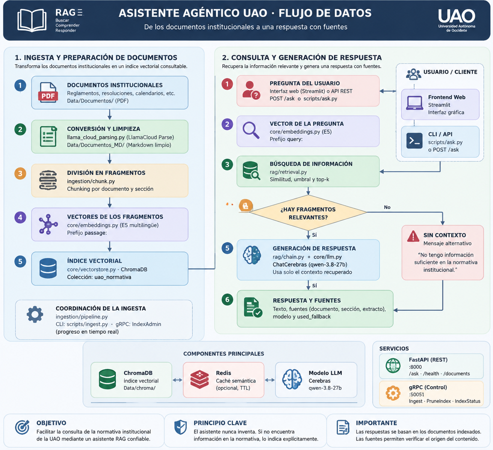

# Asistente agéntico RAG --- Asistente RAG UAO


## Descripción

El Asistente Agéntico UAO es un sistema conversacional basado en **RAG
(Retrieval-Augmented Generation)** que permite consultar información
institucional de la Universidad Autónoma de Occidente.

El sistema procesa documentos oficiales como reglamentos, resoluciones,
calendarios y políticas institucionales. A partir de estos documentos
genera una base de conocimiento que permite recuperar información
relevante y generar respuestas fundamentadas indicando las fuentes
utilizadas.

Cuando la información disponible no permite responder una consulta, el
sistema devuelve una respuesta indicando que no existe información
suficiente, evitando generar contenido no soportado.

------------------------------------------------------------------------

# Arquitectura del sistema

| Componente | Tecnología | Función |
|---|---|---|
| Frontend | Streamlit | Interfaz conversacional para el usuario |
| API | FastAPI | Gestión de consultas y respuestas |
| Control | gRPC | Administración de procesos internos |
| Base vectorial | ChromaDB | Almacenamiento y recuperación semántica |
| Embeddings | E5 Multilingual | Representación vectorial del texto |
| Modelo generador | Cerebras + Qwen | Generación de respuestas |
| Caché | Redis | Optimización de consultas frecuentes |

---

El sistema utiliza dos planos principales:

| Plano | Puerto | Función |
|---|---|---|
| Datos | `8000` | Comunicación mediante API REST para consultas del usuario |
| Control | `50051` | Comunicación mediante gRPC para administración del índice |

------------------------------------------------------------------------

# Objetivo

Desarrollar un asistente inteligente capaz de responder preguntas
relacionadas con documentación institucional mediante recuperación
semántica y generación de texto.

La arquitectura busca ser modular, reproducible y escalable, separando
procesamiento documental, recuperación de información, generación de
respuestas y servicios de interacción.

------------------------------------------------------------------------

# Funcionalidades

El proyecto incluye:

-   Conversión de documentos PDF mediante LlamaCloud Parse.
-   Procesamiento de documentos Markdown.
-   División del contenido mediante técnicas de chunking.
-   Generación de embeddings con modelos E5.
-   Almacenamiento persistente con ChromaDB.
-   Recuperación semántica de fragmentos relevantes.
-   Generación de respuestas con Qwen mediante Cerebras.
-   Sistema de caché semántica mediante Redis.
-   Consulta mediante interfaz Streamlit.
-   API REST con FastAPI.
-   Administración del índice mediante gRPC.
-   Pruebas automatizadas con pytest.

------------------------------------------------------------------------

# Flujo de datos

El siguiente diagrama muestra cómo se procesan los documentos de la UAO y cómo se utiliza su información para responder las preguntas del usuario.



------------------------------------------------------------------------

# Requisitos

El proyecto requiere diferentes tecnologías para su ejecución, desarrollo y despliegue. Cada herramienta cumple una función específica dentro de la arquitectura del asistente.

| Tecnología | Uso dentro del proyecto |
|------------|------------------------|
| Python 3.14 | Lenguaje principal utilizado para el desarrollo del sistema. |
| uv | Gestión del entorno virtual y administración de dependencias. |
| Docker Compose | Despliegue y administración de los servicios mediante contenedores. |
| ChromaDB | Base de datos vectorial utilizada para almacenar embeddings y realizar búsquedas semánticas. |
| FastAPI | Servicio REST encargado de recibir consultas y entregar respuestas. |
| Streamlit | Interfaz gráfica conversacional para la interacción con el usuario. |
| gRPC | Comunicación interna para la administración del índice y procesos de ingesta. |
| Redis | Sistema de caché semántica para optimizar consultas repetidas. |
| pytest | Framework utilizado para la ejecución de pruebas automatizadas. |

Variables necesarias:

``` text
CEREBRAS_API_KEY
LLAMA_CLOUD_API_KEY
```

Las dependencias se encuentran definidas en:

``` text
pyproject.toml
uv.lock
```

------------------------------------------------------------------------

# Instalación local

El flujo local permite trabajar sobre cada etapa del sistema RAG:

- Preparación de documentos.
- Generación del índice vectorial.
- Ejecución del backend.
- Ejecución de la interfaz gráfica.
- Validación mediante pruebas automatizadas.


## Crear entorno
Desde la carpeta raíz del proyecto se instala el entorno virtual y todas las dependencias definidas en `pyproject.toml`.

``` bash
uv sync
```

## Configurar variables

Crear archivo `.env`:

``` bash
cp .env.example .env
```

Completar las claves necesarias.

------------------------------------------------------------------------

# Ejecución con Makefile

El proyecto incluye un archivo `Makefile` que simplifica la ejecución de tareas frecuentes y evita ejecutar manualmente múltiples comandos.

Los comandos principales son:

| Comando | Descripción |
|---|---|
| `make install` | Instala las dependencias del proyecto mediante `uv`. |
| `make test` | Ejecuta las pruebas automatizadas del sistema. |
| `make api` | Inicia el servicio REST desarrollado con FastAPI. |
| `make frontend` | Inicia la interfaz gráfica desarrollada con Streamlit. |


Para transformar los documentos PDF en archivos Markdown:

``` bash
make parse
```
Después de tener los documentos procesados, se genera la base de conocimiento:

```bash
make ingest
```

------------------------------------------------------------------------

## Ejecución del backend

Para iniciar la API REST:

```bash
make api
```
La API estará disponible en:

```text
http://localhost:8000
```

La documentación interactiva de FastAPI se encuentra en:

```text
http://localhost:8000/docs
```

--------------------------------------------------------------------------

## Ejecución del frontend

En una terminal diferente se ejecuta:

```bash
make frontend
```
--------------------------------------------------------------------------

# Ejecución con Docker

La ejecución mediante Docker permite desplegar el asistente en un ambiente controlado y reproducible, evitando diferencias entre configuraciones de diferentes equipos.

La arquitectura mediante Docker Compose separa los servicios principales del sistema:

```text
Docker Compose

├── Backend API
│       FastAPI + Sistema RAG
│
├── Frontend
│       Streamlit
│
├── Redis
│       Caché semántica
│
└── Proxy
        Caddy
```
------------------------------------------------------------

## Construcción y despliegue

Para construir las imágenes y levantar todos los servicios:
``` bash
make up
```

``` bash
make down
```

## Verificar servicios activos

Para revisar el estado de los contenedores:

```bash
make ps
```

También se pueden consultar los registros del sistema:

```bash
make logs
```

## Acceso al sistema

Después de iniciar los servicios:

### Interfaz gráfica

```text
https://localhost/
```

### API REST

```text
https://localhost/api/
```

### Documentación FastAPI

```text
https://localhost/api/docs
```


### Monitoreo ML-FLOW

```text
https://mlflow.localhost
```
---

## Detener el sistema

Para apagar los servicios:

```bash
make down
```

------------------------------------------------------------------------

# API REST

Endpoints principales:

  Endpoint           Función
  ------------------ --------------------------------
  `POST /ask`        Realiza preguntas al asistente
  `GET /health`      Estado del sistema
  `GET /documents`   Consulta documentos indexados

Ejemplo:

``` json
{
 "question":"¿Cuál es el reglamento académico?"
}
```

------------------------------------------------------------------------

# Servicio gRPC

gRPC funciona como plano de control del sistema.

Operaciones:

  Método        Función
  ------------- -------------------------------
  Ingest        Ejecuta indexación documental
  PruneIndex    Elimina información obsoleta
  IndexStatus   Consulta estado del índice

Puerto:

``` text
50051
```

------------------------------------------------------------------------

# Estructura del repositorio

``` text
Asistente-agentico-UAO/
├── Data/
│   ├── Documentos/
│   ├── Documentos_MD/
│   └── chroma/
│
├── docker/
│   ├── Dockerfile
│   ├── Dockerfile.frontend
│   └── Caddyfile
│
├── scripts/
│   ├── ask.py
│   ├── ingest.py
│   ├── ingest_client.py
│   └── llama_cloud_parsing.py
│
├── src/
│   └── asistente_agentico_uao/
│       ├── core/
│       ├── rag/
│       ├── ingestion/
│       ├── api/
│       ├── frontend/
│       └── grpc_impl/
│
├── tests/
├── docker-compose.yml
├── Makefile
├── pyproject.toml
└── README.md
```

------------------------------------------------------------------------

# Pruebas

Ejecutar:

``` bash
make test
```

Las pruebas validan:

-   Configuración.
-   Procesamiento documental.
-   Chunking.
-   Embeddings.
-   Recuperación.
-   API REST.
-   gRPC.
-   Frontend.
-   Despliegue Docker.

------------------------------------------------------------------------

# Modelo utilizado

El sistema utiliza:

  Componente   Modelo
  ------------ ----------------------------------
  Embeddings   `intfloat/multilingual-e5-base`
  Generación   `qwen-3.8-27b` mediante Cerebras

El proyecto no realiza fine-tuning. La actualización del conocimiento se
realiza agregando nuevos documentos e indexando nuevamente la
información.

------------------------------------------------------------------------

# Concepto RAG

RAG combina recuperación de información y generación de lenguaje.

Primero se buscan fragmentos relevantes dentro de la base documental.
Posteriormente estos fragmentos son entregados al modelo generador para
producir una respuesta basada en información disponible.

Este enfoque permite actualizar el conocimiento del asistente sin
modificar los pesos del modelo.

------------------------------------------------------------------------

# Licencia

Este proyecto se distribuye bajo la licencia Apache 2.0.


